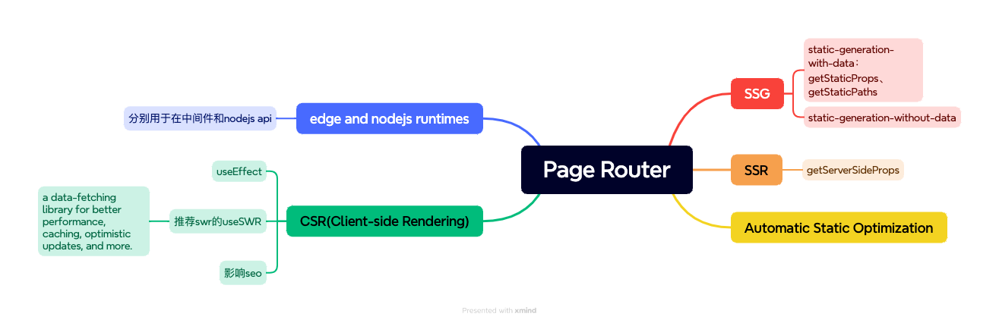

# nextjs 看性能优化

## 核心特性
- 服务器端渲染SSR：通过在服务器上预先渲染页面，加快首屏加载速度
- 静态站点生成SSG：支持静态文件的生成，适用于不需要经常更改内容的网站
- 文件系统路由：页面通过文件系统中的文件来定义，路由不用配置
- API路由：可轻松在Nextjs应用中创建API端点
- 优化：自动代码分割、图像优化等，无需手动配置
- 支持seo


## SSG、SSR、CSR、ISR
Nextjs
- SSG(Static Generation): The HTML is generated at build time  构建时 and will be reused 重用 on each request.（That means in production, the page HTML is generated when you **run next build**. ）It can be cached by a CDN.
- SSR(Server Side Rendering): The HTML is generated on each request. 每次请求时服务端生成html。
- Automatic Static Optimization：Next.js 会根据所使用的功能和 API 自动为每条路由选择最佳渲染策略。若没有页面中没有getServerSideProps和getInitialProps， Nextjs会自动决定该页面是static  if it has no blocking阻塞 data requirements. 这个特性允许Nextjs hybrid(含ssg和ssr)。
- CSR(Client Side Rendering):下载js后这些js用于更新DOM并渲染页面。应用程序首次加载时，可能会有轻微的延迟，加载后，**导航到同一网站的其他页面通常会更快**，因为只需要获取必要的数据，而且js可以重现呈现页面的某些部分而无需刷新整个页面。
- ISR(Incremental Static Regeneration): 在SSG（页面一旦生成，除非重新构建，否则页面内容不会发生变化）的基础上，它允许在页面部署上，无需重新构建整个应用，就可以对特定页面进行更新。通过设置 revalidate 参数来指定页面重新验证和更新的时间间隔。


## app router和page router在ssg、ssr、csr上应用的区别

预渲染 By default, Next.js pre-renders every page. This means that Next.js generates HTML for each page in advance. 

### Page Router




### App Router

App Router：用了react的最新特性：服务端组件、Suspense、Server Functions
`use client`、`use server`来定义服务端与客户端的边界network-boundary


## 首屏渲染速度优化
1. 代码分割：路由分组和懒加载
2. 缓存策略优化？？？？？
3. 图片等ui
    - 图片优化`next/image`：quality图片质量、placeholder模糊占位、priority加载优先级
    - 非文字类 UI 不需要 ssr，例如图表。图表接口应该异步请求，能有效提升页面访问速度。
4. ssr
    - 首屏渲染减少接口的数量
    - 首次加载视口范围内的内容，应尽量采用ssr服务端渲染，避免首屏视口范围内出现 loading
    - 首屏可以适当内联 css 优化渲染。不要滥用 transition。

5. fetch ？？？？
```tsx
import fetch from 'isomorphic-fetch';

```

6. 加载时机
    - next/script 优化 script 加载时 `lazyOnload`浏览器空闲时加载脚本
    - 非首屏 Suspense + 动态导入：`dynamic(() => import('@/pages/xxx'), { ssr: false })`
    - next/link 预加载, 基于 hover 识别用户意图，当用户 hover 到 Link 标签时，对即将跳转的页面资源进行预加载，进一步防止页面卡顿
    - 静态内容预加载,基于 `getStaticProps` 对不需要权限的内容进行预加载，它将在 NextJS 构建时被编译到页面中，减少了 http 请求数量 (适用Page router)


### webpack spilt chunks


next/link 启用 prefetch，预加载页面资源以快速切换路由。
对 cdn 使用 dns-prefetch，加速 cdn 资源访问。
seo 与加载速度不可兼得，提高访问速度的办法就是减少 ssr 接口（首屏渲染）的数量
非文字类 UI 不需要 ssr，例如图表。图表接口应该异步请求，能有效提升页面访问速度。
不要使用聚合导出，这不利于代码分割/按需引入。
使用重型插件的时候，建议使用动态导入，例如 import('echarts')，可以有效减少代码体积。
build 之后 .next/static 下的文件通过 cdn 加载。
svg 尽量不要内联到代码里
ssr 不应该渲染权限相关内容，所以 ssr 的内容和接口是可以无差别缓存的
首次加载视口范围内的内容，应尽量采用服务端渲染，避免首屏视口范围内出现 loading！
首屏可以适当内联 css 优化渲染。不要滥用 transition。


[【NextJS】一文了解 NextJS 并对性能优化做出最佳实践](https://juejin.cn/post/7154205903388934180)


## 其他问题、概念


### 服务器渲染的好处
- **数据获取**： 离数据源更近，减少客户端请求数量，减少渲染所需数据的时间
- **安全性**：敏感数据和逻辑（API密钥和token）放在服务器上，不暴露给客户端？？？？ 怎么写
- **缓存**：非交互的ui代码迁移到服务器组件，可减少客户端js代码量，从而减少浏览器下载解析执行时间
- **首屏加载绘制**：在服务器可以先生成非交互ui的html
- **seo**
- **流式传输**：服务器组件允许您将渲染工作拆分成多个快，并在准备就绪后将其流式传输到客户端，使得用户可以提前查看页面的某些部分，而无需等待整个页面在服务器上渲染完成。
    - 渲染分割：在服务器端，将页面的渲染过程分解为多个独立的部分，这些部分可以是组件或者组件的子树
    - 异步生成：每个组件或组件子树的渲染都是异步进行的。
    - 流运输：服务器通过http流将渲染好的部分发送给客户端。客户端接收到这些部分后，会立即开始渲染，而无需等待整个页面加载完成。
    - 增量更新：随着后续更多的渲染部分被发送到客户端，页面会逐步完成渲染，实现增量更新。

### （App router / Server Components）server components的rendered/呈现？
在服务端，渲染工作是先把通过路由和Boundaries将其split into chunks，

每个chunk的渲染工作有以下2个步骤：
1. 将服务端组件改成一种特殊数据格式 RSC Payload (React Server Component Payload)
2. nextjs使用RSC Payload + Client Component JavaScript 指令在服务器上呈现HTML

后，在客户端，
3. 首次页面加载，HTML立马快速展示不用交互的页面ui
4. RSC Payload reconcile（协调） 客户端和服务端组件的tree，然后更新dom
5. js指令  hydrate （水合）客户端组件，并且增加交互性


### RSC Payload
RSC Payload 是**已渲染的 React 服务器组件树**的紧凑二进制表示。React 在客户端使用它来更新浏览器的 DOM。RSC Payload 包含：

- 服务器组件渲染结果
- 客户端组件渲染位置的占位符以及对其 JavaScript 文件的引用
- 从服务器组件传递到客户端组件的任何 props


### hydrate （水合）
Hydration 是将事件监听器附加到 DOM 的过程，以使静态 HTML 具有交互性。


reconcile（协调）？？？
hydrate （水合）？？？


### 有用户token的接口请求怎么使用fetch
1. 登陆后，将token存储在localStorage + req header中；
2. 中间件middleware中拦截，判断是否有token，有token则直接next，无token则重定向到登陆页。

