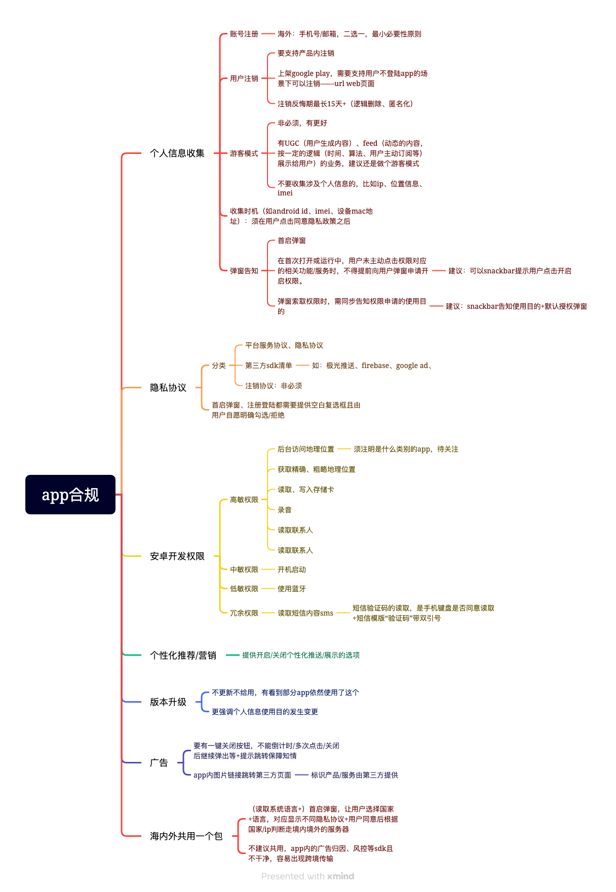
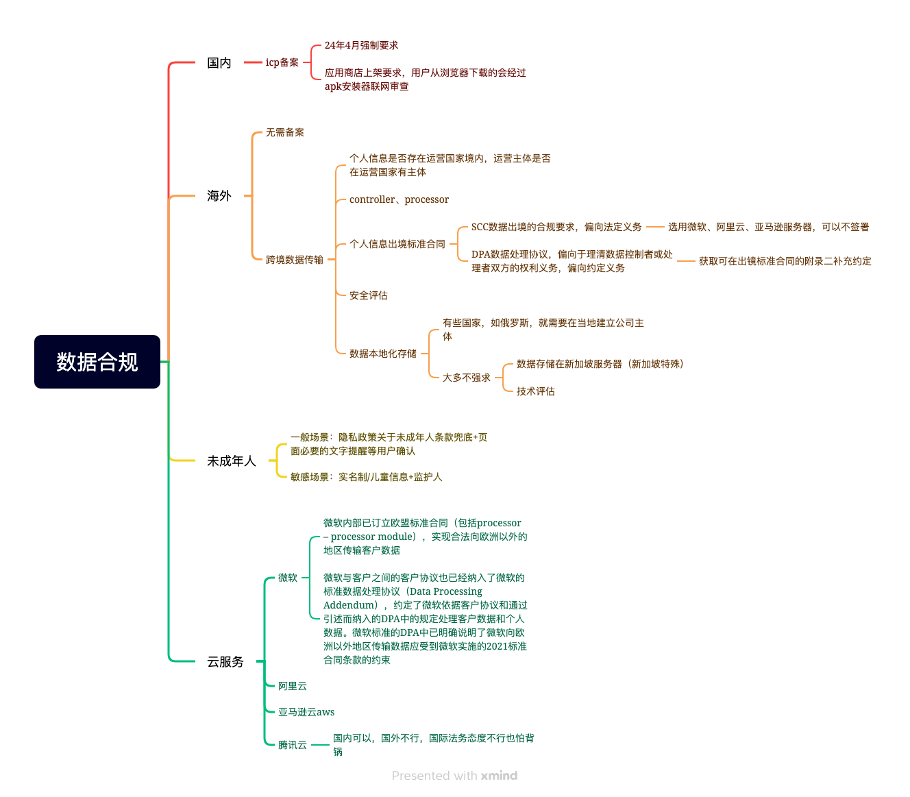

# 数据合规

## 1 app 合规上架要考虑的几个问题

## 2. 海外app 数据跨境传输要注意的问题

## 3. 概念
1. 充分性认定

充分性认定（Adequacy Decision）是欧盟法律框架下实现个人数据跨境最便利的法律工具。 对于通过欧盟充分性认定的第三国、地区、第三国的特定部门或国际组织（以下简称“第三方”）来说，将欧盟的个人数据向其传输将不需要再经过其他特别授权（Any Specific Authorisation）。

截至2023年7月10日，欧盟官网公布的通过数据保护充分性认定的国家或地区共计15个：安道尔公国、阿根廷、加拿大（限于商业组织）、法兰群岛、根西岛、以色列、马恩岛、日本、泽西岛、新西兰、韩国、瑞士、英国、乌拉圭、美国

“充分性认定”制度源自欧盟委员会根据《通用数据保护条例》（General Data Protection Regulation，以下简称“GDPR”)提出的概念（GDPR 第45条），是指个人信息可以在没有任何特别授权的情况下向已认定为“已达到充分保护标准”的国家或地区传输，即需要确定第三国是否通过国内法或者国际承诺能够与本国提供相当的个人信息保护水平的认定。该制度类似一个数据跨境流动的“白名单”，即数据处理者或控制者可以将欧盟的个人信息向获得充分性认定的国家或地区自由传输。然而，当前“白名单”上的国家或地区数量较为有限，中国也暂未被列入欧盟或英国的“白名单”，即欧盟和英国的个人信息向中国的传输无法基于此种法律基础。

## 参考文档
- [数据何规何库](https://cbe8t1r4a5.feishu.cn/wiki/wikcn0XgPycjgb1BLbE8z1nKRch)
- [oppo 2022年可持续发展报告](https://www.oppo.com/content/dam/oppo/common/mkt/footer/2022-OPPO-Sustainability-Report-CN.pdf)
- [米家 隐私政策 中国](https://g.home.mi.com/views/user-terms.html?locale=zh_CN&type=userPrivacy&version=2024&countryCode=CN)
- [微软 DPA](https://www.microsoft.com/licensing/docs/view/Microsoft-Products-and-Services-Data-Protection-Addendum-DPA?lang=5)
- [数据人应该考什么证？一文带你详细了解九大数据保护认证！](https://www.wproedu.com/compliance/iapp/xmzx/show_742.html)
- [数据合规法律业务的前景如何？](https://www.zhihu.com/question/497846124)