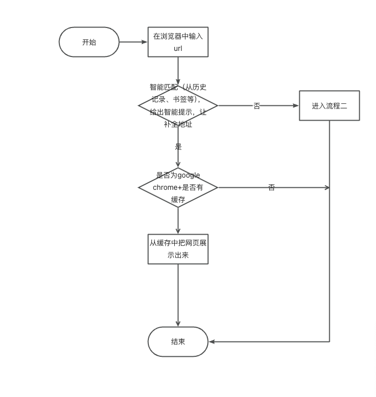
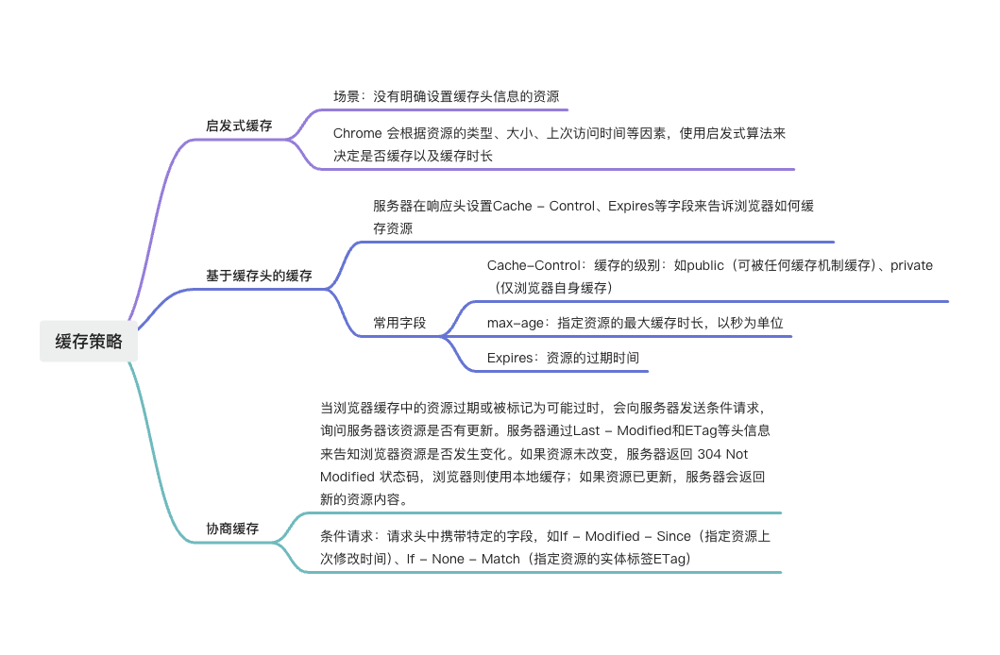
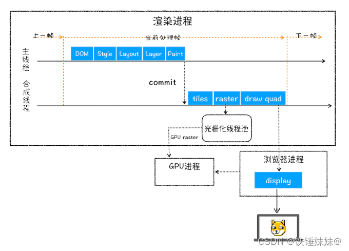
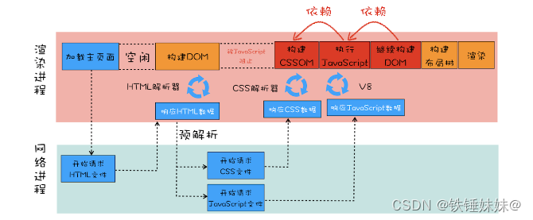
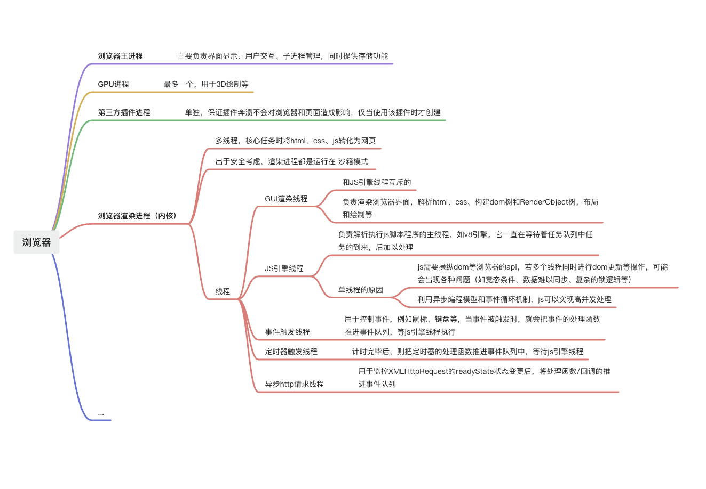

# “从输入 URL 到页面展示到底发生了什么”看性能优化

## 1. 主干流程梳理
1. 浏览器接收url并开启一个新进程（这一部分可以展开浏览器的进程与线程的关系）
2. 浏览器解析输入的 URL，提取出其中的协议、域名和路径等信息。（这部分涉及URL组成部分）
3. 浏览器向 DNS 服务器发送请求，DNS服务器通过 多层查询 将该 域名 解析为对应的 IP地址 ，然后将请求发送到该IP地址上，与 服务器 建立连接和交换数据。（这部分涉及DNS查询）
4. 浏览器与服务器建立 TCP 连接。（这部分涉及TCP三次握手/四次挥手/5层网络协议）
5. 浏览器向服务器发送 HTTP 请求，包含请求头和请求体。（4,5,6,7包含http头部、响应码、报文结构、cookie等知识）
6. 服务器接收并处理请求，并返回响应数据，包含状态码、响应头和响应体。
7. 浏览器接收到响应数据，解析响应头和响应体，并根据状态码判断是否成功。
8. 如果响应成功，浏览器接收到http数据包后的解析流程（这部分涉及到html - 词法分析，解析成DOM树，解析CSS生成CSSOM树（样式树），合并生成render渲染树（样式计算）。然后layout布局，分层，调用GPU绘制等，最后将绘制的结果合成最终的页面图像，显示在屏幕上。这个过程会发生回流和重绘）。
9. 连接结束 - 断开TCP连接 四次挥手

## 1. 输入地址

**性能优化点**：缓存

## 2. DNS域名解析

`DNS`：用于将`域名`解析为`IP地址`的系统，目的是将人们易于记忆的域名转换为计算机能够识别的IP地址。

`DNS解析过程`：首先在浏览器、操作系统、路由器缓存中查找该域名对应的 DNS 解析结果，（通常是缓存一段时间），如果以上缓存都没有命中，浏览器会向 DNS 服务器发送`递归查询`请求。DNS 服务器会递归查询，直到找到对应的 IP 地址。

`递归查询`：从根域名服务器发送请求，根域名服务器会返回顶级域名服务器的 IP 地址，然后从顶级域名服务器发送请求，顶级域名服务器会返回权威（下一级）域名服务器的 IP 地址，然后从权威域名服务器发送请求，权威域名服务器会返回对应的 IP 地址。

`CDN`：CDN（Content Delivery Network）是一种通过将内容分发到离用户最近的服务器来提高访问速度的技术。CDN可以将静态资源（如图片、脚本、样式）缓存在离用户最近的服务器上，从而减少DNS查询次数，提高访问速度。

**dns解析耗时，性能优化点**：
1. 减少DNS查询次数：
    - 缓存DNS记录：浏览器、操作系统、路由器缓存
    - 合并域名，多个资源（如图片、脚本、样式）放在同一域名下，减少不同域名的DNS查询
2. 使用CDN加速：
    - 选择合适的CDN服务商，
    - 配置CDN缓存策略，根据内容更新频率设置缓存时间。对于不常变化的静态资源，如网站 logo、样式表等，可设置较长缓存时间；对于动态内容，如实时新闻，缓存时间要短，确保用户获取最新信息。同时，可根据不同内容类型设置不同缓存策略，如图片、脚本、HTML 文件等可分别配置。
3. 使用DNS预解析：
    - 服务器配置：服务器可通过设置特定的响应头来告知浏览器进行 DNS 预解析
    - 可以在`link`标签中使用`dns-prefetch`属性，指定要预解析的域名。

## 3. 建立TCP链接
`TCP`：传输控制协议，是一种面向连接的、可靠的、基于字节流的传输层协议。

拿到IP地址后，就可以发起http请求了。http请求的本质就是TCP/IP的请求构建。浏览器会与服务器建立TCP连接。

`TCP连接过程`：
1. 建立连接`三次握手`：
    - 客户端向服务器发送一个 SYN 报文，表示请求建立连接。
    - 服务器接收到 SYN 报文后，向客户端发送一个 SYN+ACK 报文，表示同意建立连接。
    - 客户端接收到 SYN+ACK 报文后，向服务器发送一个 ACK 报文，表示连接建立成功。
2. 断开连接`四次挥手`：
    - 客户端向服务器发送一个 FIN 报文，表示请求关闭连接。
    - 服务器接收到 FIN 报文后，向客户端发送一个 ACK 报文，表示同意关闭连接。
    - 服务器向客户端发送一个 FIN 报文，表示请求关闭连接。
    - 客户端接收到 FIN 报文后，向服务器发送一个 ACK 报文，表示连接关闭成功。

为什么需要四次挥手？
因为TCP连接是`全双工`的，即数据可以**在两个方向上独立地进行传输**。因此，在断开连接时，需要在两个方向上都发送 FIN 报文，以确保连接的完整性。

TCP/IP的分层管理
- 应用层：HTTP、FTP、SMTP等，最靠近用户的一层
- 传输层：TCP、UDP，客户端和服务器之间的通信
- 网络层：IP，IP寻址及路由选择等
- 数据链路层：ARP、RARP，处理连接网络的硬件部分，硬件上的范畴均在链路层的作用范围内

## 4. 浏览器向服务器发送http请求
`http请求`：浏览器向服务器发送的请求，包含请求行、请求头和请求体。

请求头的`Content-Type`常见取值：
- application/x-www-form-urlencoded： 以键值对的数据格式提交，默认值
- multipart/form-data：用于文件上传等二进制数据
- application/json：JSON数据
- text/plain：纯文本数据

**性能优化点**：HTTP缓存策略 （详见下图其中一个部份）：

## 5. 页面渲染流程

浏览器接收到 http 数据包后后, 向服务器发起请求下载资源, 然后解析流程(涉及到：html 的词法分析，然后解析成 DOm 树, 同时解析 css 生成 css 规则树, 合并生成render 树. 然后 layout 布局、painting 渲染、复合图层的合成、GPU绘制、外链接处理、loaded 和 documentloaded 等). 若在下载js文件，解析器会停止对 html 的解析，这就出现了 js 阻塞问题。

1. 解析html，构建dom树
2. 解析css，样式计算，构建cssom树，
3. 合并dom树和cssom树，生成render树
4. 布局layout阶段（会发生回流），计算元素的位置和大小
5. 分层阶段，渲染线程会使用一套复杂的策略对整个布局树中进行分层，浏览器的页面实际上被分成了很多图层，这些涂层叠加后合成了最终的页面。

    因为页面中有很多复杂的效果，如一些复杂的3D变换、页面滚动等，或者使用z-index做z轴排序等，为了更加方便地实现这些效果，渲染引擎还需要为特定的节点生成专用的图层，并生成一棵对应的图层树（Layer Tree）。

    分层的好处，（同tcp分层），将来某一层改变后，仅会对该层进行后续处理，从而提升效率。

    通常满足下面两点中任意一点的元素可以被单独提升为单独的一个图层：
    - 拥有层叠上下文属性的元素，（如定位、透明、滤镜、z-index等）
    - 需要剪裁clip的元素，如`overflow: hidden`
    - 滚动条也是单独的一层
    - 可通过`will-change`属性更大程度的影响分层结果

6. 图层绘制paint阶段（会发生重绘）
将一个图层的绘制，拆分成很多小的`绘制指令`，然后将这些指令按照顺序组成一个`绘制列表`，最后按照顺序执行这些绘制指令

7. 栅格化（raster）操作
绘制列表知识用来记录绘制顺序和绘制指令的列表，而`栅格化`操作会将绘制列表转换成`位图`，也就是像素信息。栅格化过程会使用GPU来加速生成。

8. 合成和显示
将所有层的位图合并后，生成最终的页面。合成过程会使用GPU来加速生成。

`回流`：当元素的位置、大小、布局等属性发生变化时，浏览器需要重新计算元素的位置和大小，这个过程称为回流。

会引起回流的场景：
- 页面首次渲染
- 浏览器窗口大小改变
- 元素的内容发生变化
- 元素的位置、尺寸发生变化
- **元素的字体大小发生变化**
- 添加/删除可见的dom元素
- 激活css伪类
- 查询某些属性或者调用某些方法

`重绘`：当元素的外观（如颜色、背景等）发生变化时，浏览器需要重新绘制元素，这个过程称为重绘。

`回流`和`重绘`都会导致页面的重新渲染，但是它们的代价是不同的。

`回流`的代价是`CPU`计算量较大，因为需要重新计算元素的位置和大小，而`重绘`的代价是`GPU`计算量较大，因为需要重新绘制元素。

**性能优化**：
- 减少回流
    - 使用css动画代替js动画，css动画使用GPU加速，在性能方面通常比js动画更高效。使用css的`transform`和`opacity`属性来创建动画，而不是改变元素的布局属性，如宽高等。直接在非主线程上执行合成动画操作，效率最好，没有占用主线程的资源。
    - 使用`translate3d`开启硬件加速，强制使用GPU加速，避免回流
    - 避免频繁地修改样式，最好一次性修改多个样式
    - 使用requestAnimationFrame调度动画帧，可确保在浏览器的重绘周期内执行，避免不必要的回流，确保动画在最佳时间点渲染
    - 使用文档片段（DocumentFragment）来批量操作dom元素，减少回流次数（vue 虚拟dom的做法）
    - 使元素脱离文档流：`position: absolute`、`position: fixed`、`float`等
    - 使用`visibility: hidden`隐藏元素，而不是`display: none`，因为`display: none`会触发回流和重绘，而`visibility: hidden`只会触发重绘

### 首屏渲染
1. 在首屏减少加载js文件
因为js的加载、解析与执行会阻塞文档的渲染，将控制权转移给js引擎。
2. 渲染完再加载js 
`defer`要等到整个页面再内存中正常渲染结束（DOMContentLoaded 事件触发），再执行。

`async`一旦下载完，渲染引擎就会中断渲染，执行这个脚本后，再继续渲染。

## 其他知识点参考

### 浏览器进程与线程

### cookie

在登陆页面，用户登陆了  此时，服务端会生成一个<code>session</code>，<code>session</code>中有对应用户的信息（如用户名、密码等）  然后会有一个<code>sessionid</code>（相当于是服务端的这个session对应的key）  然后服务端在登录页面中写入<code>cookie</code>，值就是: jsessionid=xxx  然后浏览器本地就有这个<code>cookie</code>了，以后访问<code>同域名</code>下的页面时，自动带上cookie，自动检验，在有效时间内无需二次登陆。

2、浏览器查找域名的 IP 地址
3、浏览器向 web 服务器发送一个 HTTP 请求
4、服务器的永久重定向响应
6、服务器处理请求

7、服务器返回一个 HTTP 响应
8、浏览器显示 HTML
9、浏览器发送请求获取嵌入在 HTML 中的资源（如图片、音频、视频、CSS、JS等等）

# url\cdn

# 资源加载

vite 可以做什么

# 渲染

涉及  nextjs 服务端渲染运用的原理

