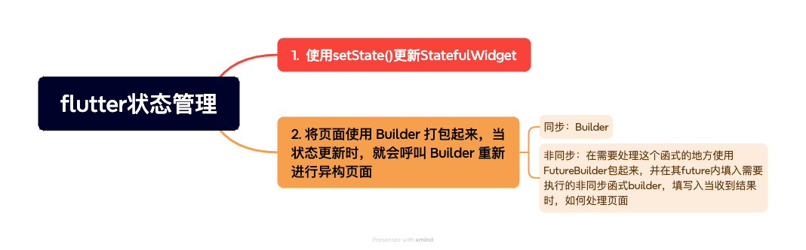
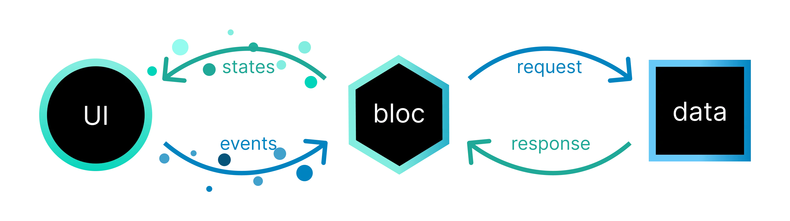

## 一些思考 

### 相同点：
1. **集中管理状态**：将应用的状态集中存储和管理，避免状态的分散和不一致。
2. **单向数据流**：都遵循数据从触发源（如 dispatch、事件等）到状态更新，再到视图更新的单向流动，保证了数据流向的清晰和可预测性。
3. 提高可维护性：通过**将状态管理与业务逻辑分离**，使得代码更易于理解、测试和维护。

### 可能会用到的设计模式
1. 观察者模式：状态的改变会通知相关的观察者（通常是视图组件）进行更新。
2. 单一职责原则：状态管理的逻辑被独立封装，各自承担明确的职责。

### 软件架构
1. 关注点分离（Separation of concerns, SOC）：将状态与视图、业务逻辑分离，使每个部分可以专注于自身的核心功能

## Architecture

### flutter 常见的

### [flutter bloc](https://bloclibrary.dev/zh-cn/architecture/)

## 参考文档
[Flutter — 为什么你需要状态管理工具？ 以 BLoC 为例](https://andyludeveloper.medium.com/flutter-%E7%82%BA%E4%BB%80%E9%BA%BC%E4%BD%A0%E9%9C%80%E8%A6%81%E7%8B%80%E6%85%8B%E7%AE%A1%E7%90%86%E5%B7%A5%E5%85%B7-%E4%BB%A5-bloc-%E7%82%BA%E4%BE%8B-43412763fdfb)